# FreshLoop — Smart Running Route Generator

A Flutter app that **designs** running routes for you: given a start point and a target
distance, it generates loop routes ranked by a quality score over **air quality**,
**elevation**, and **scenery/greenery**, with along-route photos — then lets you follow
the route with live GPS tracking and export a report.

It *designs* a run rather than tracking one — staying original instead of being another
run-tracker clone.

Final project for *Design and Implementation of Mobile Applications* (Politecnico di
Milano, Prof. Luciano Baresi).

## Screenshots

<p align="center">
  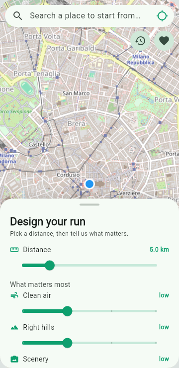
  &nbsp;
  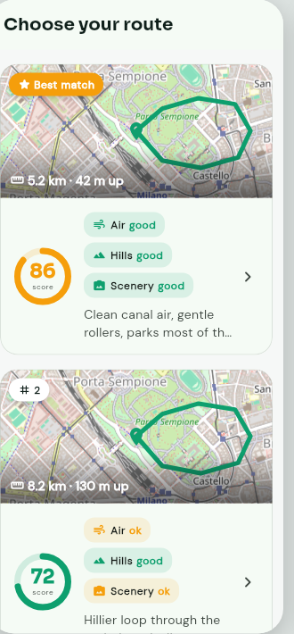
  &nbsp;
  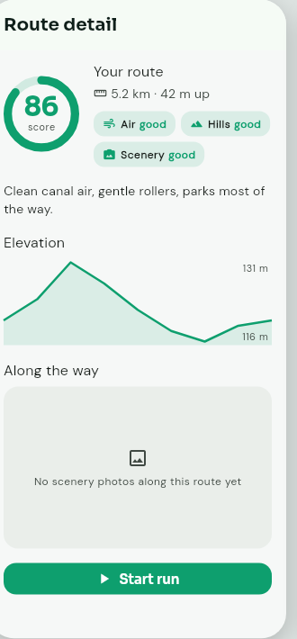
</p>
<p align="center"><em>The route-generation flow (M3) — <b>home</b> (map-forward "design your run" sheet) → <b>candidates</b> (ranked cards: route preview, score, per-axis badges) → <b>route detail</b> (map loop, elevation profile, along-the-way photos). Theme A: Sora / DM Sans, trail-green + amber.</em></p>

<p align="center">
  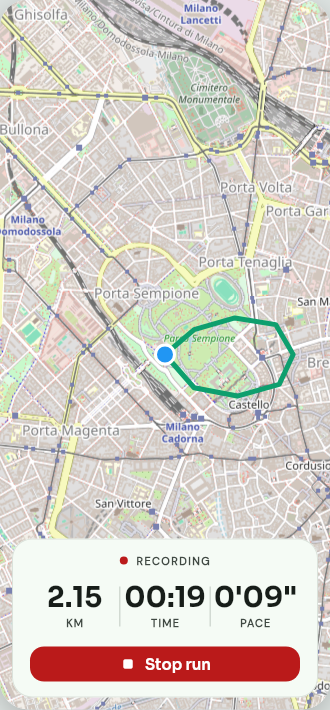
  &nbsp;
  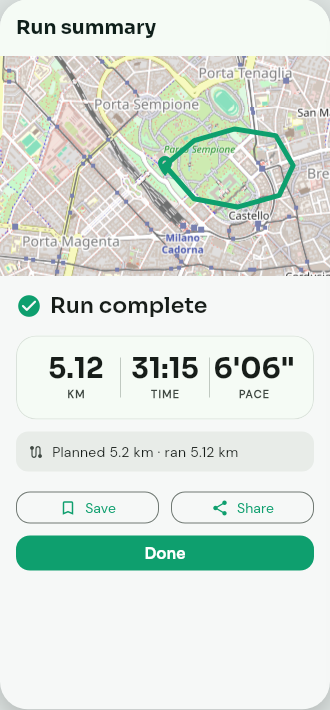
</p>
<p align="center"><em>Live run (M4) — <b>tracking</b> (the map follows you with live distance/time/pace + a current-location dot) → <b>post-run summary</b> (trail, stats, planned-vs-actual, share).</em></p>

<p align="center">
  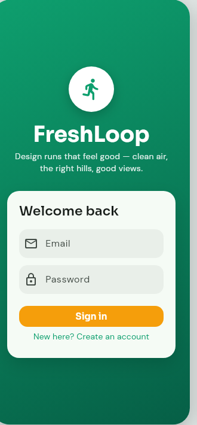
  &nbsp;
  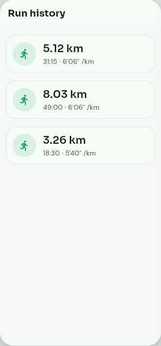
  &nbsp;
  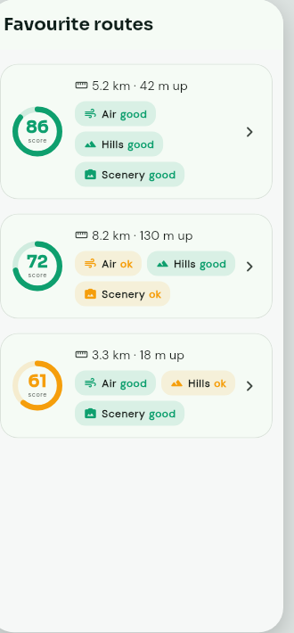
</p>
<p align="center"><em>Accounts (M5) — <b>sign in / create account</b> → <b>run history</b> and <b>favourite routes</b>, synced to Firebase under <code>/users/&lt;uid&gt;</code> and isolated per user by Firestore security rules (with on-device fallback when offline/unconfigured).</em></p>

<p align="center">
  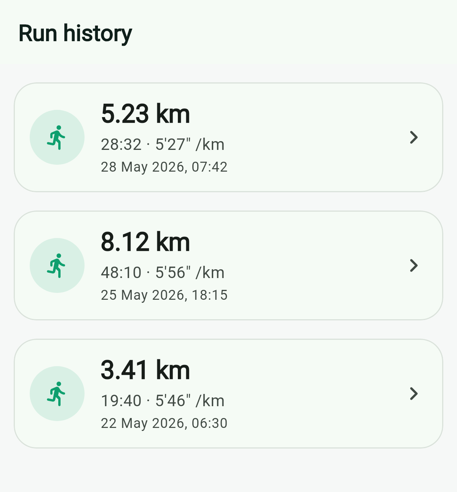
  &nbsp;
  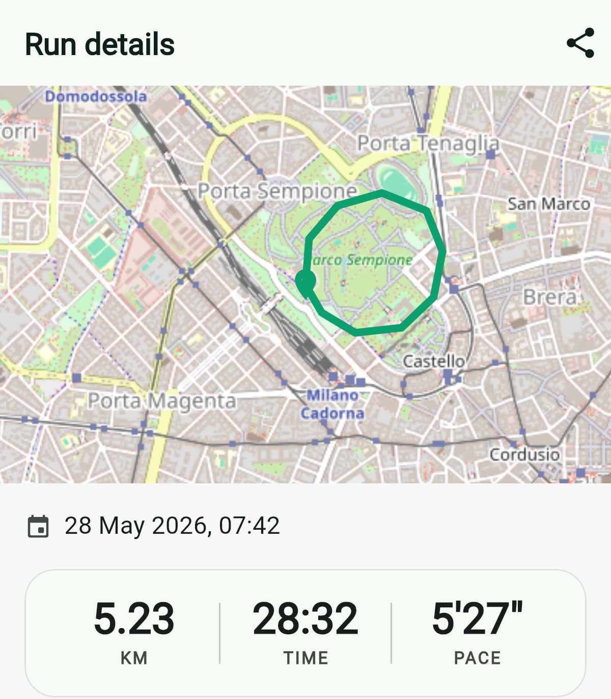
</p>
<p align="center"><em>Openable run history — each past run shows <b>the date it was run</b> and is tappable; opening it shows the <b>trail on a map</b> with full stats (distance / time / pace).</em></p>

### Multi-device (tablet / landscape)

<p align="center">
  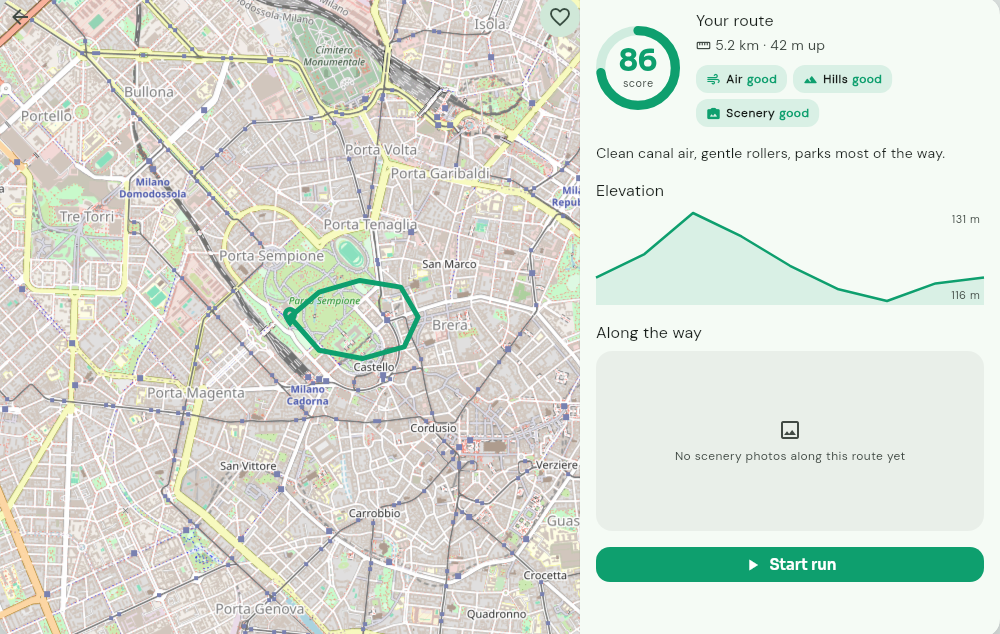
</p>
<p align="center"><em>The same screens adapt by width (one <code>isWide</code> breakpoint, 720dp). On a wide screen the route detail is a <b>map + detail panel side-by-side</b> (above) and the candidates become a <b>multi-column grid</b>; on phones they're a draggable sheet over the map and a single-column list. This is genuine width-adaptive layout — the course's "multi-device" requirement.</em></p>

### Visual direction

Look-&-feel is grounded in the course's design principles. We evaluated three directions and chose **A**:

<p align="center">
  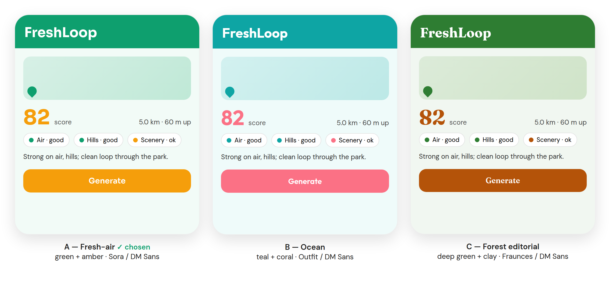
</p>

| | Direction | Palette · Typography | Why |
|---|---|---|---|
| **A** ✅ | Fresh-air cartographic | trail-green `#0E9F6E` + amber accent · Sora / DM Sans | sporty & outdoors; clearest CTA, best legibility — closest to the app's purpose |
| B | Ocean | teal + coral · Outfit / DM Sans | calm/wellness feel; running energy weaker |
| C | Forest editorial | deep green + clay · Fraunces / DM Sans | most distinctive, but an editorial serif risks mismatch with a running tool |

Full rationale: [visual design direction](docs/level-2-architecture/visual-design-direction-2026-05-31.md) · [UX & grading checklist](docs/level-2-architecture/ux-and-rubric-checklist-2026-05-31.md).

## Status

**Complete — all milestones M1–M6 shipped.** The full journey works end to end: **design** a run
(start + distance + air/hills/scenery weights) → **compare** ranked candidate routes → **inspect**
a route (map, elevation, along-the-way photos) → **run** it live (map-follow + distance/time/pace)
→ review a **post-run summary** → and **sign in** to sync **run history & favourite routes** to the
cloud (Firebase Auth + Firestore, each user isolated by security rules, with an on-device fallback).
The UI adapts from phone-portrait to tablet/landscape. **128 tests passing**, static analysis clean,
built incrementally across reviewed PRs, and **released as v1.0.0** (Android APK).

### Recent updates (post-release, from on-device testing)

- **Start a run anywhere** — a home **address search with live type-ahead** (Photon, an OSM-based geocoder built for autocomplete: typing "Carre" surfaces nearby **Carrefour**s, **sorted nearest-first** with each one's **straight-line distance from you**) plus a **GPS "locate me"** button set the start point from your real location, not a fixed city centre. *(Replaced Nominatim, whose `/search` isn't a prefix matcher — "Carre" matched towns named "Carrè" worldwide instead of the shop near you.)*
- **Google-Maps-style search feel** — modelled on how Maps biases predictions to the visible map: results now **follow the map** (pan to another area and the next search re-biases there, like "search this area"), predictions fire from the **2nd character** (debounced), you can **long-press the map to start a run anywhere** (reverse-geocoded to a place name), and a clear (×) button resets the box.
- **Collapsible map** — the "Design your run" sheet drags down to a handle so the map goes near full-screen (and you can see the start marker), then snaps back up to set params.
- **Sharper along-the-way photos** — request Mapillary's 1024px thumbnails (was upscaled/blurry); fetched in parallel; 360° panoramas are kept as a badged fallback instead of an empty strip.
- **Tap to view photos** — full-screen zoom/pan; **360° panoramas open in a real spherical viewer** (drag to look around). The viewer **lazy-loads a high-resolution image** — panoramas pull the **original full-resolution** image (2048px is still soft once wrapped on a 360° sphere), with a loading spinner and automatic fall-back if it fails; perspective shots use 2048px. The carousel keeps the light 1024px thumbnail.
- **Openable run history** — tap any past run to see its **trail on a map**, full stats (distance / time / pace), and **the date it was run** (runs now store a start timestamp).
- **Correct Android back** — navigating into a route now stacks screens, so the system Back button returns to the previous screen instead of quitting the app.
- **Robustness** — a clear "API key missing — build with `--dart-define-from-file=secrets.json`" error instead of a cryptic ORS 401; the home sheet is width-capped/centred on wide screens.

## How route generation works

<p align="center">
  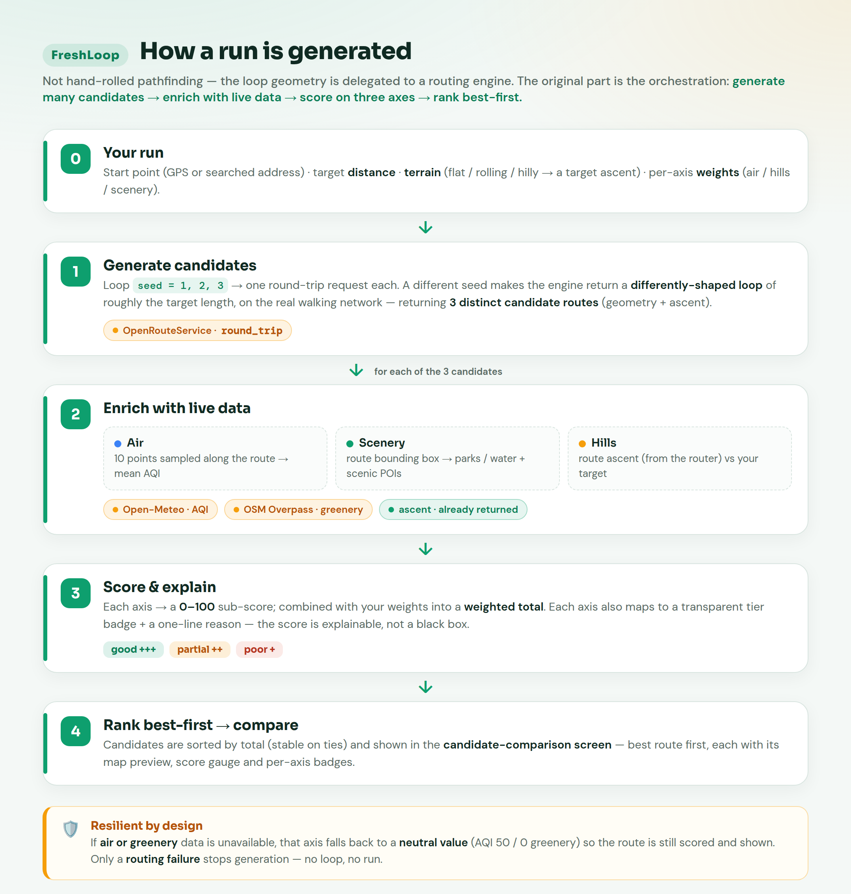
</p>

FreshLoop doesn't hand-roll pathfinding — the loop **geometry** is delegated to OpenRouteService's
round-trip routing. The original part is the **orchestration**: it **over-generates** differently-shaped
loops and keeps the ones **closest to the requested distance** (round-trip routing can deviate a lot
where the trail network is sparse), **enriches** each candidate with live data (Open-Meteo AQI, OSM
Overpass greenery, and the route's own ascent), **scores** it on three axes, and **ranks** the
candidates best-first for the comparison screen. Enrichment failures degrade to neutral values so a
route is still scored; only a routing failure stops generation. See
[`lib/services/route_generator.dart`](lib/services/route_generator.dart).

## How route scoring works

Each candidate loop is scored 0–100 on three axes, then combined with user-set weights:

- **Air** — the lower the AQI sampled along the route, the higher the score.
- **Elevation** — how close the actual ascent is to the runner's *target* (flat for
  beginners, hilly for training) — a preference match, not "flatter is always better".
- **Scenery** — greenery/water coverage in the route corridor plus scenic waypoints passed.

Each axis maps to a 3-tier badge (good / partial / poor) with a one-line explanation,
inspired by the WHO assessment rubric — so the score is transparent, not a black box.

## Roadmap

- [x] **M1** — Foundation: app shell + pure-Dart scoring engine
- [x] **M2** — External data layer: routing (OpenRouteService) + geocoding (Nominatim) + air quality (Open-Meteo) + greenery (OSM Overpass) + photos (Mapillary, Wikimedia), all behind injectable, fully mock-tested clients
- [x] **M3.1** — Route-generation engine: `RouteGenerator` (orchestrates clients + scorer into ranked candidates) + `RouteGenCubit`
- [x] **M3.2** — Route-generation UI: map-forward home, params sheet, candidate-comparison cards (Theme A)
- [x] **M3.3** — Route detail: map + elevation chart + AQI/greenery badges + scenery photo carousel
- [x] **M4.1** — Run-tracking engine: `RunTrackingCubit` + mockable `LocationSource` (geolocator) + distance math
- [x] **M4.2** — Tracking UI: live run screen (map-follow + distance/time/pace + stop) + post-run summary; current-location marker
- [x] **M5.1** — History & favourites behind repository interfaces (on-device persistence)
- [x] **M5.2** — Email/password auth + Firestore cloud sync (mock-tested), behind the same interfaces
- [x] **M5.3** — Firebase activated at runtime: auth gate + per-user cloud repos + local fallback (live-verified)
- [x] **M6** — Multi-device adaptation (grid + side-by-side), polish & accessibility, end-to-end flow test

## Tech stack

Flutter · flutter_bloc · http · geolocator · flutter_map (OSM) · go_router · Firebase · share_plus

## Getting started

```bash
flutter pub get
flutter test        # 127 unit/widget tests (no network/Firebase — fully mocked)

# Live APIs need keys. Copy the template, fill in your keys, and pass it at
# run/build time — WITHOUT this flag, route generation fails with a clear
# "API key missing" error (the keys are compile-time --dart-define values).
cp secrets.example.json secrets.json
flutter run -d chrome --dart-define-from-file=secrets.json
flutter build apk --release --target-platform android-arm64 --dart-define-from-file=secrets.json
```

## Development process &amp; provenance

This was built **incrementally and traceably** by a single author — the whole R&D journey is on
GitHub, not a single drop. Every milestone followed the same loop: a **design doc → test-driven
implementation → two independent reviews (specification + code quality) → a reviewed pull request**
merged to `main`.

- 📋 **[`CHANGELOG.md`](CHANGELOG.md)** — the milestone-by-milestone development log (design phase → M1–M6 → the post-release on-device iteration), each with its PR.
- 🔀 **[Pull requests (15)](https://github.com/Marxtu/freshloop/pulls?q=is%3Apr+is%3Amerged)** — one per milestone/step: design → implement → review → merge.
- 🕒 **[Commit history](https://github.com/Marxtu/freshloop/commits/main)** — real incremental commits.
- 🏷️ **[Releases](https://github.com/Marxtu/freshloop/releases)** — `v0.1.0-m1`, `v0.2.0-m2`, `v1.0.0` (Android APK).

### Documentation (layered)

- **Level 1 — Foundation:** [course-materials analysis](docs/level-1-foundation/course-materials-analysis-2026-05-30.md) — problem framing, rubric, framework decision.
- **Level 2 — Architecture:** [system design (SSOT)](docs/level-2-architecture/running-route-generator-2026-05-30.md) · [UX &amp; rubric checklist](docs/level-2-architecture/ux-and-rubric-checklist-2026-05-31.md) · [visual direction](docs/level-2-architecture/visual-design-direction-2026-05-31.md)
- **Level 3 — Implementation:** per-milestone plans in [`docs/level-3-implementation/`](docs/level-3-implementation) (M1 … M6).
- **Reviews &amp; report:** [UI review](docs/audit/ui-review-2026-05-31.md) · [project report](docs/project-report-2026-05-31.md)

## Secrets

API keys are never committed. Copy the `.example` templates to local config (gitignored).
See the design doc §13.7.

To run against live APIs, copy the template to a gitignored `secrets.json`, fill in your keys, and pass it at run/build time:

```bash
cp secrets.example.json secrets.json
flutter run --dart-define-from-file=secrets.json
```
