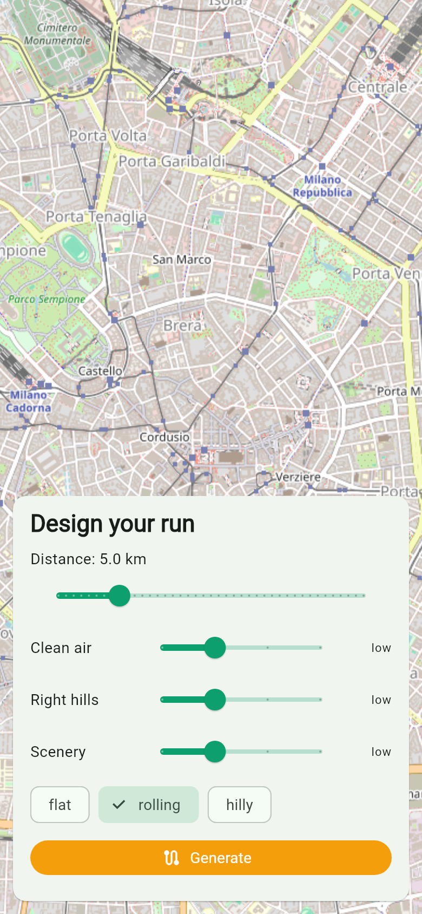
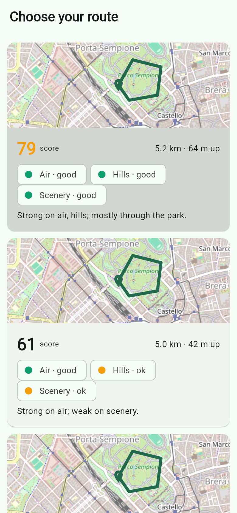
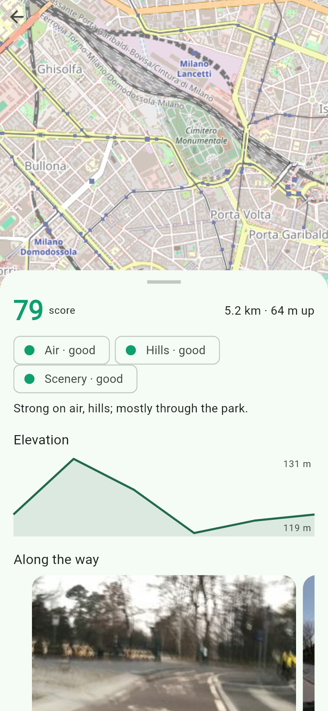

# FreshLoop — Smart Running Route Generator

A Flutter app that **designs** running routes for you: given a start point and a target
distance, it generates loop routes ranked by a quality score over **air quality**,
**elevation**, and **scenery/greenery**, with along-route photos — then lets you follow
the route with live GPS tracking and export a report.

It *designs* a run rather than tracking one — staying original instead of being another
run-tracker clone.

Final project for *Design and Implementation of Mobile Applications* (Politecnico di
Milano, Prof. Luciano Baresi).

## Screenshots

<p align="center">
  
  &nbsp;
  
  &nbsp;
  
</p>
<p align="center"><em>The route-generation flow (M3) — <b>home</b> (map-forward "design your run" sheet) → <b>candidates</b> (ranked cards: route preview, score, per-axis badges) → <b>route detail</b> (map loop, elevation profile, along-the-way photos). Theme A: Sora / DM Sans, trail-green + amber.</em></p>

### Visual direction

Look-&-feel is grounded in the course's design principles. We evaluated three directions and chose **A**:

<p align="center">
  
</p>

| | Direction | Palette · Typography | Why |
|---|---|---|---|
| **A** ✅ | Fresh-air cartographic | trail-green `#0E9F6E` + amber accent · Sora / DM Sans | sporty & outdoors; clearest CTA, best legibility — closest to the app's purpose |
| B | Ocean | teal + coral · Outfit / DM Sans | calm/wellness feel; running energy weaker |
| C | Forest editorial | deep green + clay · Fraunces / DM Sans | most distinctive, but an editorial serif risks mismatch with a running tool |

Full rationale: [visual design direction](docs/level-2-architecture/visual-design-direction-2026-05-31.md) · [UX & grading checklist](docs/level-2-architecture/ux-and-rubric-checklist-2026-05-31.md).

## Status

**M4 — Live run tracking: complete.** Beyond M3 (design & compare routes), you can now tap
**Start run** to track live — the map follows you with distance / time / pace, then a post-run
summary shows the trail, stats, and planned-vs-actual. Built on the full data + scoring stack
(M1–M3), the M4.1 engine (`RunTrackingCubit` + a mockable `LocationSource` over geolocator),
and the M4.2 screens. **91 tests passing**, static analysis clean. Next: M5 — Firebase
accounts, history, favourites.

Latest release: **[v0.2.0-m2](https://github.com/Marxtu/freshloop/releases/tag/v0.2.0-m2)** (`freshloop-0.2.0-m2-arm64.apk`).

## How route scoring works

Each candidate loop is scored 0–100 on three axes, then combined with user-set weights:

- **Air** — the lower the AQI sampled along the route, the higher the score.
- **Elevation** — how close the actual ascent is to the runner's *target* (flat for
  beginners, hilly for training) — a preference match, not "flatter is always better".
- **Scenery** — greenery/water coverage in the route corridor plus scenic waypoints passed.

Each axis maps to a 3-tier badge (good / partial / poor) with a one-line explanation,
inspired by the WHO assessment rubric — so the score is transparent, not a black box.

## Roadmap

- [x] **M1** — Foundation: app shell + pure-Dart scoring engine
- [x] **M2** — External data layer: routing (OpenRouteService) + geocoding (Nominatim) + air quality (Open-Meteo) + greenery (OSM Overpass) + photos (Mapillary, Wikimedia), all behind injectable, fully mock-tested clients
- [x] **M3.1** — Route-generation engine: `RouteGenerator` (orchestrates clients + scorer into ranked candidates) + `RouteGenCubit`
- [x] **M3.2** — Route-generation UI: map-forward home, params sheet, candidate-comparison cards (Theme A)
- [x] **M3.3** — Route detail: map + elevation chart + AQI/greenery badges + scenery photo carousel
- [x] **M4.1** — Run-tracking engine: `RunTrackingCubit` + mockable `LocationSource` (geolocator) + distance math
- [x] **M4.2** — Tracking UI: live run screen (map-follow + distance/time/pace + stop) + post-run summary; current-location marker
- [ ] **M5** — Firebase auth/storage, history, favorites, profile
- [ ] **M6** — Multi-device adaptation, polish, and integration tests

## Tech stack

Flutter · flutter_bloc · http · geolocator · flutter_map (OSM) · go_router · Firebase · share_plus

## Getting started

```bash
flutter pub get
flutter test        # 76 unit/widget tests
flutter run         # on a device/emulator, or: flutter run -d chrome
```

## Documentation

- **Design (SSOT):** [`docs/level-2-architecture/running-route-generator-2026-05-30.md`](docs/level-2-architecture/running-route-generator-2026-05-30.md)
- **Foundation (course analysis):** [`docs/level-1-foundation/course-materials-analysis-2026-05-30.md`](docs/level-1-foundation/course-materials-analysis-2026-05-30.md)
- **M1 implementation plan:** [`docs/level-3-implementation/m1-foundation-and-scoring-2026-05-30.md`](docs/level-3-implementation/m1-foundation-and-scoring-2026-05-30.md)

## Secrets

API keys are never committed. Copy the `.example` templates to local config (gitignored).
See the design doc §13.7.

To run against live APIs, copy the template to a gitignored `secrets.json`, fill in your keys, and pass it at run/build time:

```bash
cp secrets.example.json secrets.json
flutter run --dart-define-from-file=secrets.json
```
